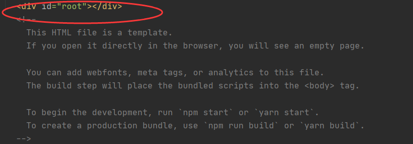

[第05节：HelloWorld和组件的讲解](https://jspang.com/detailed?id=46#toc220)

这节课先把`src`目录里的文件全部删除，我们一点点写一个·HelloWorld·程序，并通过编写这个程序了解一下什么是`React`中的组件化编程。

# [入口文件的编写](https://jspang.com/detailed?id=46#toc321)

写一个项目的时候一般要从入口文件进行编写的，在`src目录`下，新建一个文件`index.js`，然后打开这个文件。

写入下面4行代码:

```javascript
import React from 'react'
import ReactDOM from 'react-dom'
//组件化开发，其中App也是我们需要写的组件
import App from './App'
//把APP模块渲染/挂载到了`root` ID上面
ReactDOM.render(<App />,document.getElementById('root'))
//为什么是挂在到root上可以看index.html，id为root
```

补充：ReactDOM.render的说明文档https://reactjs.org/docs/react-dom.html#render



上面的代码，我们先引入了React两个必要的文件，然后引入了一个APP组件，目前这个组件还是没有的，需要一会建立。然后用React的语法把APP模块渲染到了`root` ID上面.这个rootID是在`public\index.html`文件中的。

这样入口文件就写好了，这时候我们就需要写APP组件了。

# [app组件的编写](https://jspang.com/detailed?id=46#toc322)

现在写一下App组件，这里我们采用最简单的写法，就输出一个`Hello JSPang`,就可以了。

```javascript
import React, {Component} from 'react'

class App extends Component{
    render(){
        return (
            <div>
                Hello JSPang
            </div>
        )
    }
}
export default App;
```

这里有一个难点，就是：

```javascript
import React, {Component} from 'react'
```

这其实是ES6的语法-解构赋值，如果你分开写就比较清楚了，你可以把上面一行代码写成下面两行.

```javascript
import React from 'react'
const Component = React.Component
```

如果你对ES6语法不熟悉，你完全可以使用这种形式来进行编写。

当我们这两个文件都编写完成后，可以在终端使用`npm start`命令，来看一下我们编写的结果了。

**总结：**React的主要优势之一就是组件化编写，这也是现代前端开发的一种基本形式。所以我们在学习React的时候就要多用这种思想，只有不断练习，我们才能在工作中得心应手，轻松自如。小伙伴们也动手作一下吧。