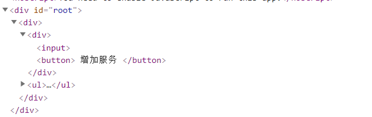
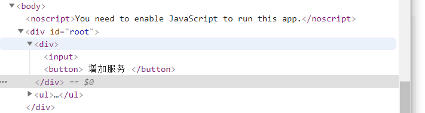

# [第07节：React实例-小姐姐服务菜单](https://jspang.com/detailed?id=46#toc227)

通过六节的学习，已经对React有了基本的认识。最好的学习就是在实战中的成长了，我们开始以作一个《小姐姐服务菜单》的应用，练习以前所学的知识和学习新知识。当然这个视频不是教大家作CSS的，所以我就不进行样式布局了。

现在`SRC`的目录下面，新建一个文件`Xiaojiejie.js`文件，然后写一个基本的HTML结构。代码如下：

```javascript
import React,{Component} from 'react'

class Xiaojiejie extends Component{
    render(){
        return  (
            <div>
               <div><input /> <button> 增加服务 </button></div>
               <ul>
                   <li>头部按摩</li>
                   <li>精油推背</li>
               </ul> 
            </div>
        )
    }
}
export default Xiaojiejie 
```

这个文件现在还没有什么功能，只是写完了一个小组件。然后我们把入口文件的`<App />`组件换成`Xiajiejie`组件。

# [组件外层包裹原则](https://jspang.com/detailed?id=46#toc329)

这是一个很重要的原则，比如上面的代码，我们去掉最外层的`<Div>`，就回报错，因为React要求必须在一个组件的最外层进行包裹。

错误代码(因为外边少了最外层的包裹):

```javascript
import React,{Component} from 'react'

class Xiaojiejie extends Component{
    render(){
        return  (
               <div><input /> <button> 增加服务 </button></div>
               <ul>
                   <li>头部按摩</li>
                   <li>精油推背</li>
               </ul> 
        )
    }
}
export default Xiaojiejie 
```

所以我们在写一个组件的时候，组件的最外层都需要有一个包裹。

# [Fragment标签讲解](https://jspang.com/detailed?id=46#toc330)

加上最外层的DIV，组件就是完全正常的，但是你的布局就偏不需要这个最外层的标签怎么办?比如我们在作`Flex`布局的时候,外层还真的不能有包裹元素。这种矛盾其实React16已经有所考虑了，为我们准备了`<Fragment>`标签。

要想使用`<Fragment>`，需要先进行引入。

```javascript
import React,{Component,Fragment } from 'react'
```



然后把最外层的`<div>`标签，换成`<Fragment>`标签，代码如下。



```javascript
import React,{Component,Fragment } from 'react'

class Xiaojiejie extends Component{
    render(){
        return  (
            <Fragment>
               <div><input /> <button> 增加服务 </button></div>
               <ul>
                   <li>头部按摩</li>
                   <li>精油推背</li>
               </ul> 
            </Fragment>
        )
    }
}
export default Xiaojiejie 
```

这时候你再去浏览器的`Elements`中查看，就回发现已经没有外层的包裹了。

**总结:**下节课我们要实现增加服务项，期待下一集和技术胖一起开车吧。