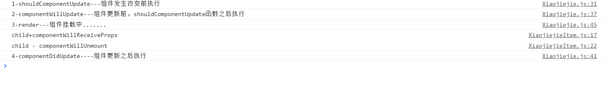

1.自我理解，生命周期函数，相当于是各个函数，各个函数之间的区分在于：时间相关的属性，以及被触发的条件

2.段落二三级表示重要程度


`React`的生命周期是非常重要的知识点，所以关于React声明周期的课程可以多看几遍，我也会尽量的把React的生命周期讲的细致。生命周期的课程我分成三节来讲，这样更容易让你理解。


这张图看起来有点复杂，但是小伙伴们不要有恐慌心里，我会抽丝剥茧，给你详细讲解。

通过这张图你可以看到React声明周期的四个大阶段：

1. `Initialization`:初始化阶段。
2. `Mounting`: 挂在阶段。(虚拟DOM)
3. `Updation`: 更新阶段。
4. `Unmounting`: 销毁阶段

[什么是生命周期函数](http://www.jspang.com/detailed?id=46#toc370)

如果非要用一句话把生命周期函数说明白，我觉的可以用这句话来说明：

> 生命周期函数指在某一个时刻组件会自动调用执行的函数

举例：写的小姐姐的例子。里边的`render()`函数，就是一个生命周期函数，它在state发生改变时自动执行。这就是一个标准的自动执行函数。

- `constructor`不算生命周期函数。

`constructor`我们叫构造函数，它是ES6的基本语法。虽然它和生命周期函数的性质一样，但不能认为是生命周期函数。

但是你要心里把它当成一个生命周期函数，我个人把它看成React的`Initialization`阶段，定义属性（props）和状态(state)。

## [Mounting阶段](http://www.jspang.com/detailed?id=46#toc371)

Mounting阶段叫挂载阶段，伴随着整个虚拟DOM的生成，它里边有三个小的生命周期函数，分别是：

1. `componentWillMount` : 在组件即将被挂载到页面的时刻执行。
2. `render` : 页面state或props发生变化时执行。(渲染)
3. `componentDidMount` : 组件挂载完成时被执行。

### **componentWillMount**代码

```js
componentWillMount(){
    console.log('componentWillMount----组件将要挂载到页面的时刻')
}
```

### **componentDidMount**代码

```js
componentDidMount(){
    console.log('componentDidMount----组件挂载完成的时刻执行')
}
```

## **render**代码

```js
render(){
    console.log('render---组件挂载中.......')
}
```

这时候我们查看一下控制台，会为我们打出如下提示：

```s
componentWillMount----组件将要挂载到页面的时刻执行
render----开始挂载渲染
componentDidMount----组件挂载完成的时刻执行
```

这也是生命周期的顺序。有小伙伴会问我，这个函数书写有顺序吗?哪个在前？哪个在后？其实是没有顺序的，你可以随便改动他们的顺序。

**注意的问题**

`componentWillMount`和`componentDidMount`这两个生命周期函数，只在页面刷新时执行一次，而`render`函数是只要有state和props变化就会执行，这个初学者一定要注意。

视频中会举例说明。

总结:这节课讲解了React的生命周期函数，先是简单了解了一下React生命周期函数的四大阶段，然后又详细学习了一下`Mounting`挂载阶段中的三个生命周期函数。下节课会学习`Updation`阶段的生命周期函数。

# [第20节：React高级-生命周期讲解-2](http://www.jspang.com/detailed?id=46#toc272)

这节继续学习React生命周期中的`Updation`阶段,也就是组件发生改变的更新阶段，这是React生命周期中比较复杂的一部分，它有两个基本部分组成，一个是`props`属性改变，一个是`state`状态改变（这个在生命周期的图片中可以清楚的看到）。

## **`shouldComponentUpdate`**

函数会在组件更新之前，自动被执行。比如写入下面的代码:

```javascript
shouldComponentUpdate(){
    console.log('shouldComponentUpdate---组件发生改变前执行')
}
```

它要求返回一个布尔类型的结果，必须有返回值，这里就直接返回一个`true`了（真实开发中，这个是有大作用的）。

```javascript
shouldComponentUpdate(){
    console.log('shouldComponentUpdate---组件发生改变前执行')
    return true
}
```

现在就可以在控制台`console`里看到结果了，并且结果是每次文本框发生改变时都会随着改变。如果你返回了`false`，这组件就不会进行更新了。 简单点说，就是返回true，就同意组件更新;返回false,就反对组件更新。

（甚至Xiaojiejie.js:36 render---组件挂载中......都不再输出）

## [componentWillUpdate函数](http://www.jspang.com/detailed?id=46#toc374)

`componentWillUpdate`在组件更新之前，但`shouldComponenUpdate`之后被执行。但是如果`shouldComponentUpdate`返回false，这个函数就不会被执行了。

```javascript
//shouldComponentUpdate返回true才会被执行。
componentWillUpdate(){
    console.log('componentWillUpdate---组件更新前，shouldComponentUpdate函数之后执行')
}
```

## [componentDidUpdate](http://www.jspang.com/detailed?id=46#toc375)

`componentDidUpdate`在组件更新之后执行，它是组件更新的最后一个环节。

```javascript
componentDidUpdate(){
    console.log('componentDidUpdate----组件更新之后执行')
}
```

为了方便我们看出结果，可以在每个函数前加上序号。最后我们可以看到控制台输出的结果如下：

```
1-shouldComponentUpdate---组件发生改变前执行
2-componentWillUpdate---组件更新前，shouldComponentUpdate函数之后执行
3-render----开始挂载渲染
4-componentDidUpdate----组件更新之后执行
```

结果和我们写的顺序也是相对的，讲到这里，你一定对React的生命周期函数有了比较直观的了解了。

### [componentWillReceiveProps 函数](http://www.jspang.com/detailed?id=46#toc376)

我们可以先在`Xiaojiejie.js`组件里写下这个函数，例如下面的代码。

```javascript
componentWillReceiveProps(){
    console.log('componentWillReceiveProps')
}
```

这时候会发现函数什么时候都不会被执行，因为`Xiaojiejie.js`算是一个顶层组件，它并没接收任何的`props`。可以把这个函数移动到`XiaojiejieItem.js`组件中。

凡是组件都有生命周期函数，所以子组件也是有的，并且子组件接收了`props`，这时候函数就可以被执行了。

```javascript
componentWillReceiveProps(){
        console.log('child - componentWillReceiveProps')
    }
```

这个时候再预览，就会看到`componentWillReceiveProps`执行了。那现在可以总结一下它的执行时间了。

> 子组件接收到父组件传递过来的参数，父组件render函数重新被执行，这个生命周期就会被执行。

- 也就是说这个组件第一次存在于Dom中，函数是不会被执行的;
- 如果已经存在于Dom中，函数才会被执行。

这个生命周期算是比较复杂的一个生命周期，需要我们花点时间去消化。

这节课就把`updation`里的生命周期函数都讲过了，下节课会把剩下的一点`Unmounting`讲了，然后会讲一下生命周期的实际应用。

# [第21节：React高级-生命周期讲解-3](http://www.jspang.com/detailed?id=46#toc277)

其实这节课算是一个小的补充，把最后一个React的生命周期函数讲一下，这个生命周期周期函数就是`componentWillUnmount`，它是在组件去除时执行。

这个函数时组件从页面中**删除**的时候执行，比如在`XiaojiejieItem.js`，写入下面的代码:

```javascript
//当组件从页面中删除的时候执行
componentWillUnmount(){
    console.log('child - componentWillUnmount')
}
```

写完后，可以到浏览器终端中查看结果，当我们点击服务项，服务项被删除时，这个函数就被执行了。



**总结**:通过三节课的学习，我们已经把React的所有生命周期函数都讲完了，下节课会具体讲一下生命周期函数在实际开发中的应用。