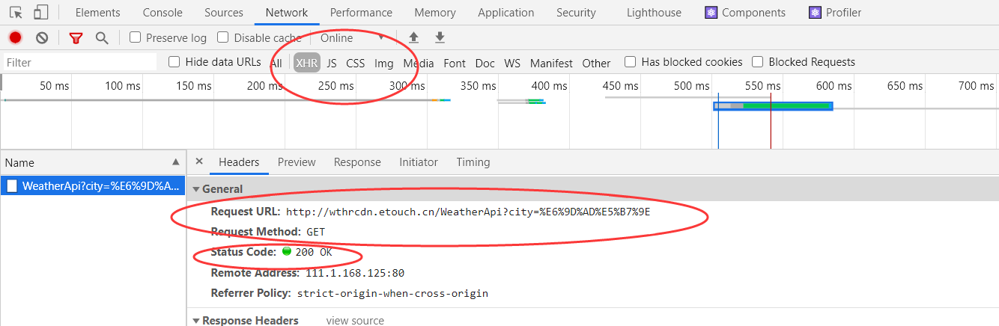

有了生命周期的知识，这节课学习远程数据请求的知识，小伙伴们肯定都知道，`ajax`可以远程请求，但是这写起来太麻烦了，我们用程序的ajax请求框架`Axios`来实现。

`Axios`的安装可以使用npm来进行安装，你可以直接在项目根目录下，输入下面的代码。

```
npm install -save axios
```

输入 后就可以正在的开始安装了。

# [npm install -save 和 -save-dev分不清](http://www.jspang.com/detailed?id=46#toc384)

- `npm install xxx`: 安装项目到项目目录下，不会将模块依赖写入`devDependencies`或`dependencies`。
- `npm install -g xxx`: `-g`的意思是将模块安装到全局，具体安装到磁盘哪个位置，要看 `npm cinfig prefix`的位置
- `npm install -save xxx`：`-save`的意思是将模块安装到项目目录下，并在`package`文件的`dependencies`节点写入依赖。
- `npm install -save-dev xxx`：`-save-dev`的意思是将模块安装到项目目录下，并在`package`文件的`devDependencies`节点写入依赖。

作为一个前端，要清楚的知道`npm install`这四种用法，防止项目依赖错误，在别人下载你的代码没办法跑起来。

生产环境：开发完成后部署在服务器上需要的依赖

开发环境：测试，项目管理


# [axios请求数据](http://www.jspang.com/detailed?id=46#toc385)

安装好`axiso`之后，需要在使用ajax的地方先引入`axios,比如现在想在`Xiaojiejie.js`中使用`axios`，写入下面的代码进行引入:

```js
import axios from 'axios'
```

引入后，可以在`componentDidMount`生命周期函数里请求ajax，我也建议在`componentDidMount`函数里执行，因为在render里执行，会出现很多问题，比如一直循环渲染；在`componentWillMount`里执行，在使用RN时，又会有冲突。所以强烈建议在`componentDidMount`函数里作`ajax`请求。

```js
componentDidMount(){
    axios.post('https://web-api.juejin.im/v3/web/wbbr/bgeda')
        .then((res)=>{console.log('axios 获取数据成功:'+JSON.stringify(res))  })
        .catch((error)=>{console.log('axios 获取数据失败'+error)})
}
```

上面的代码是以掘金的一个接口为例，做了一次`ajax`请求。并且请求到了数据，给我们返回了。 总结：这节课学习了`Axios`的简单用法，并用最简单的方式，请求到了一个掘金网站的数据接口。ajax请求在你的项目中，会经常使用，也是我们读取和写入数据的一个桥梁，所以学习`React`的过程中，使用`Axios`作ajax请求非常重要，动手练习一下吧。

