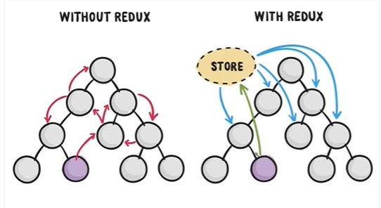

## [Flux和Redux的关系](https://jspang.com/detailed?id=48#toc34)

因为在我看来Redux就是Flux的升级版本，早期使用React都要配合Flux进行状态管理，但是在使用中，Flux显露了很多弊端，比如多状态管理的复杂和易错。所以Redux就诞生了，现在已经完全取代了Flux，过时的东西就不再讲解了。

如果你说公司还在用Flux，你可以试着学会Redux后，进行升级，抛弃Flux，其实前端的知识就是更新淘汰的这么迅速，要时刻保持学习的习惯。

