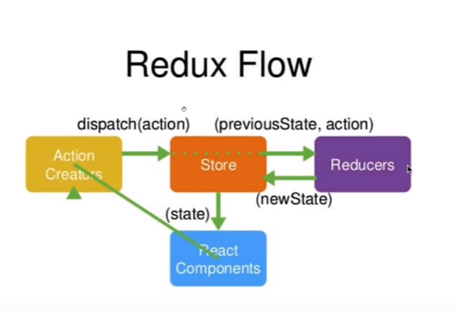

首先，用户发出 Action。

> ```javascript
> store.dispatch(action);
> ```

然后，Store 自动调用 Reducer，并且传入两个参数：当前 State 和收到的 Action。 Reducer 会返回新的 State 。

> ```javascript
> let nextState = todoApp(previousState, action);
> ```

State 一旦有变化，Store 就会调用监听函数。

> ```javascript
> // 设置监听函数
> store.subscribe(listener);
> ```

`listener`可以通过`store.getState()`得到当前状态。如果使用的是 React，这时可以触发重新渲染 View。

> ```javascript
> function listerner() {
>   let newState = store.getState();
>   component.setState(newState);   
> }
> ```