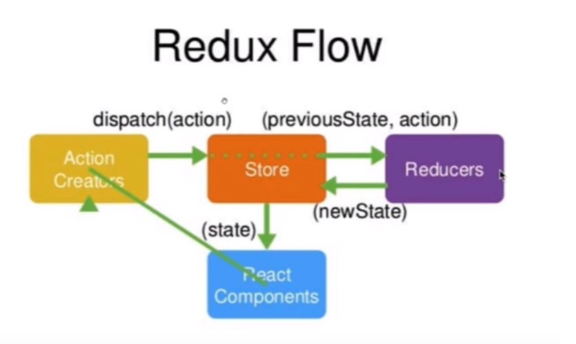

这节开始，算是正式进入了`Redux`的编码阶段，你也要集中注意力进行学习了。开始编码前，你应该再熟悉一下以前讲的redux的工作流程。所以我也把图片放到了文字下方，方便你的预习。 从图片中可以看出，`Redux`工作流程中有四个部分，最重要的就是`store`这个部分，因为它把所有的数据都放到了`store`中进行管理。在编写代码的时候，因为重要，所以要优先编写`store`。



# [编写创建`store`仓库](https://jspang.com/detailed?id=48#toc319)

在使用`Redux`之前，需要先用`npm install`来进行安装,打开终端，并进入到项目目录，然后输入。（如果你之前安装过了，就不用再次安装了）

```shell
npm install --save redux
```

安装好`redux`之后，在`src`目录下创建一个`store`文件夹,然后在文件夹下创建一个`index.js`文件。

`index.js`就是整个项目的`store`文件，打开文件，编写下面的代码。

```js
import { createStore } from 'redux'  // 引入createStore方法
const store = createStore()          // 创建数据存储仓库
export default store                 //暴露出去
```

这样虽然已经建立好了仓库，但是这个仓库很混乱，这时候就需要一个有管理能力的模块出现，这就是`Reducers`。这两个一定要一起创建出来，这样仓库才不会出现互怼现象。在`store`文件夹下，新建一个文件`reducer.js`,然后写入下面的代码。

```js
const defaultState = {}  //默认数据
export default (state = defaultState,action)=>{  //就是一个方法函数
    return state
}
```

- `state`: 是整个项目中需要管理的数据信息,这里我们没有什么数据，所以用空对象来表示。

这样`reducer`就建立好了，把reducer引入到`store`中,再创建store时，以参数的形式传递给store。

```js
import { createStore } from 'redux'  //  引入createStore方法
import reducer from './reducer'    
const store = createStore(reducer) // 创建数据存储仓库
export default store   //暴露出去
```

# [在store中为todoList初始化数据](https://jspang.com/detailed?id=48#toc320)

仓库`store`和`reducer`都创建好了，可以初始化一下`todoList`中的数据了，在`reducer.js`文件的`defaultState`对象中，加入两个属性:`inputValue`和`list`。代码如下

```js
const defaultState = {
    inputValue : 'Write Something',
    list:[
        '早上4点起床，锻炼身体',
        '中午下班游泳一小时'
    ]
}
export default (state = defaultState,action)=>{
    return state
}
```

这就相当于你给`Store`里增加了两个新的数据。

# [组件获得`store`中的数据](https://jspang.com/detailed?id=48#toc321)

有了store仓库，也有了数据，那如何获得stroe中的数据那？你可以在要使用的组件中，先引入store。 我们todoList组件要使用store，就在`src/TodoList.js`文件夹中，进行引入。这时候可以删除以前写的data数据了。

```js
import store from './store/index'
```

当然你也可以简写成这样:

```js
import store from './store'
```

引入`store`后可以试着在构造方法里打印到控制台一下，看看是否真正获得了数据，如果一切正常，是完全可以获取数据的。

```js
constructor(props){
    super(props)
    console.log(store.getState())
}
```

这时候数据还不能在UI层让组件直接使用，我们可以直接复制给组件的`state`，代码如下(我这里为了方便学习，给出全部代码了).

```js
import React, { Component } from 'react';
import 'antd/dist/antd.css'
import { Input , Button , List } from 'antd'
import store from './store'


class TodoList extends Component {
constructor(props){
    super(props)
    //关键代码-----------start
    this.state=store.getState();
    //关键代码-----------end
    console.log(this.state)
}
    render() { 
        return ( 
            <div style={{margin:'10px'}}>
                <div>

                    <Input placeholder={this.state.inputValue} style={{ width:'250px', marginRight:'10px'}}/>
                    <Button type="primary">增加</Button>
                </div>
                <div style={{margin:'10px',width:'300px'}}>
                    <List
                        bordered
                        //关键代码-----------start
                        dataSource={this.state.list}
                        //关键代码-----------end
                        renderItem={item=>(<List.Item>{item}</List.Item>)}
                    />    
                </div>
            </div>
         );
    }
}
export default TodoList;
```

通过上面的步骤，我们从仓库里取出了数据，并用在组件的UI界面上，也算是一个小小的进步了。 这节课我们讲了如何创建`store`，`reduce`和如何使用`store`中的数据。这节课的知识也算redux思想的一个精髓，也非常重要，可以多学习两遍。